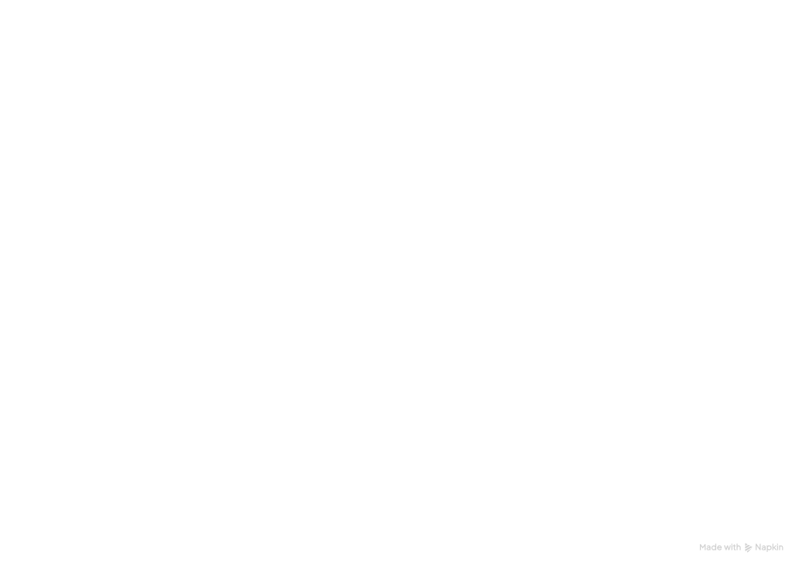
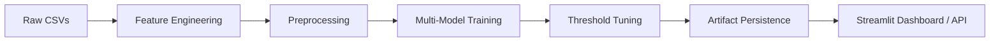

# 🛡️ Adversarial Fraud Detection


A production-grade, multi-model fraud detection pipeline built on the [IEEE-CIS Fraud Detection dataset](https://www.kaggle.com/c/ieee-fraud-detection). This project implements high-precision behavioral feature engineering, adversarial-aware preprocessing, and threshold-optimized classification to detect sophisticated fraud patterns.


---

## 📖 Overview

Standard fraud detection systems often fail to catch "adversarial" behavior—where fraudsters intentionally mask their identity or mimic legitimate user patterns. This pipeline treats **missing identity data** and **behavioral inconsistencies** as primary signals rather than noise, utilizing advanced gradient boosting models to handle sparse, high-cardinality categorical data.

### Key Features
- **Multi-Model Ensemble**: Evaluates Logit, Random Forest, XGBoost, and CatBoost.
- **Behavioral Signals**: Maps transaction velocity and card/email inconsistencies.
- **Adversarial Preprocessing**: Intelligently handles missingness as a "strong signal" of fraudulent intent.
- **Precision-Recall Optimization**: Custom threshold tuning to minimize false negatives in high-stakes financial environments.
- **Interactive Dashboard**: Real-time visualization and batch scoring via Streamlit.

---

## 🏗️ Architecture



The pipeline is organized into modular components:



---

## 📂 Project Structure

```text
├── artifacts/             # Serialized models & metadata (joblib)
├── dataset/               # Raw and processed data (CSVs)
├── tests/                 # Unit tests for features and inference
├── app.py                 # Streamlit interactive dashboard
├── train.py               # End-to-end training pipeline
├── score.py               # CLI for batch scoring
├── features.py            # Signal engineering logic
├── models.py              # Model architecture definitions
├── evaluate.py            # Metric tracking & PR-AUC optimization
├── predict.py             # Inference wrapper & persistence
├── Dockerfile             # Container configuration
└── requirements.txt       # Dependency manifest
```

---

## 🚀 Getting Started

### Prerequisites
- Python 3.10+
- [Docker](https://www.docker.com/) (Optional)

### Installation

1. **Clone the repository:**
   ```bash
   git clone https://github.com/Chetan4812/Adversarial-Fraud-Detection.git
   cd Adversarial-Fraud-Detection
   ```

2. **Setup virtual environment:**
   ```bash
   python -m venv venv
   source venv/bin/activate  # macOS/Linux
   pip install -r requirements.txt
   ```

3. **Data Preparation:**
   Place your training files in the `dataset/` directory:
   - `dataset/train_transaction.csv`
   - `dataset/train_identity.csv`

---

## 🛠 Usage

### 1. Training the Pipeline
The `train.py` script performs feature engineering, trains all models, compares their PR-AUC, and saves the best-performing model to `artifacts/`.
```bash
python train.py --transaction dataset/train_transaction.csv --identity dataset/train_identity.csv
```

### 2. Interactive Dashboard
Launch the Streamlit app to upload new CSVs and visualize fraud distribution in real-time.
```bash
streamlit run app.py
```

### 3. Batch Scoring (CLI)
For automated workflows, use the CLI tool:
```bash
python score.py --transaction dataset/test_transaction.csv --identity dataset/test_identity.csv --output results.csv
```

### 4. Running Tests
Ensure system integrity by running the test suite:
```bash
python3 -m pytest
```

---

## 🐳 Docker Deployment

The project is fully containerized. To build and run the Streamlit dashboard in a container:

```bash
# Build the image
docker build -t fraud-detection .

# Run the container
docker run -p 8501:8501 fraud-detection
```

---

## 📊 Methodology Highlights

| Technique | Goal |
| :--- | :--- |
| **Missingness Mapping** | Identifying rows with high 'identity' null counts as fraud indicators. |
| **Categorical Splitting** | Extracting Browser/OS versions to find outliers in user agents. |
| **Imbalance Handling** | Utilizing `scale_pos_weight` in XGBoost/CatBoost to handle the rare nature of fraud. |
| **Time-Split Validation** | Splitting data chronologically to prevent leakage from future events. |

---

## 📌 Roadmap
- [ ] **Target Encoding**: Implement for high-cardinality features like `card1`.
- [ ] **REST API**: Wrap the model in a FastAPI endpoint for low-latency inference.
- [ ] **SHAP Integration**: Add model interpretability to explain *why* a transaction was flagged.
- [ ] **DVC Integration**: Implement Data Version Control for large datasets.

---

## 📄 License
This project is licensed under the MIT License - see the [LICENSE](LICENSE) file for details.

Built for the [IEEE-CIS Fraud Detection Challenge](https://www.kaggle.com/c/ieee-fraud-detection).
